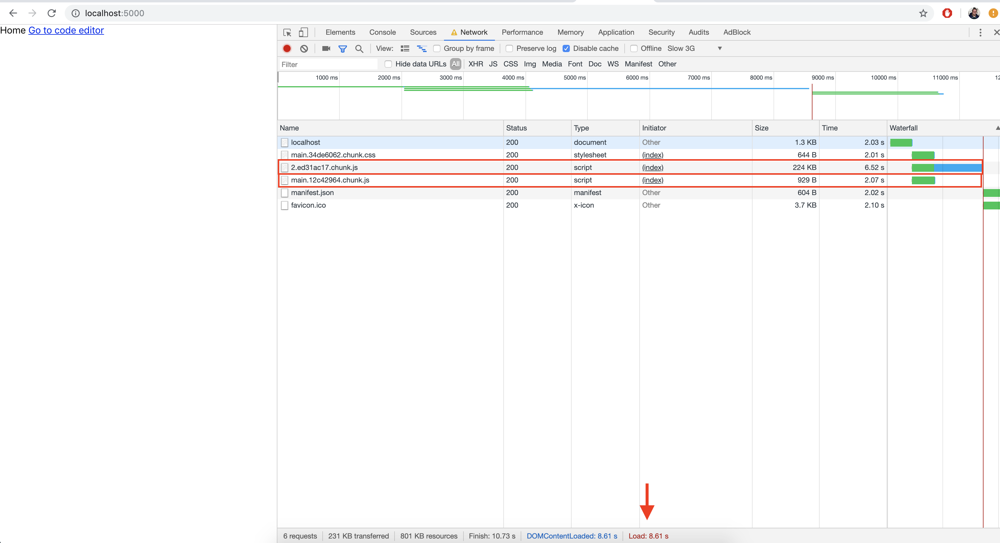

Often during application development, we do not care much about the size of our bundle, but with the code base growing, we need to think about it not only for speed and performance, but also to take responsibility for data consumption of user. So how do we load our assets as quickly as possible by taking advantage of concurrent browser requests and only when the user needs them?


**Font: [https://docs.pushtechnology.com/cloud/latest/manual/html/designguide/solution/support/connection_limitations.html](https://docs.pushtechnology.com/cloud/latest/manual/html/designguide/solution/support/connection_limitations.html)**

A good option for this is to use the **Code Split** technique. This technique consists of split the code into smaller chunks and load them just when they are required. Let's see a use case.

In [Fauna Dashboard](https://dashboard.fauna.com) we have pages where we are using code editors and the dependencies for them are not small even after gzip. So we do not want to put this in the main piece and make the first rendering longer / costly than necessary and second, not always the user will access the code editor. For this case, splitting code is a good option and I'll show you how to do it without any headaches, but before we get started, let's code something and run some analysis.

Let's use [create-react-app](https://github.com/facebook/create-react-app) to start a new React project and create the components:

```bash
create-react-app lazy-demo
cd lazy-demo
yarn add @reach/router react-ace
```

**App.jsx**
```jsx
import React from "react";
import { Router, Link } from "@reach/router";
import Home from "./Home";
import Code from "./Code";

const App = () => {
  return (
    <Router>
      <Home path="/" />
      <Code path="code" />
    </Router>
  );
};

export default App;
```

**Home.jsx**
```jsx
import React from "react";
import { Link } from "@reach/router";

const Home = () => (
  <>
    <h1>Home</h1>
    <Link to="/code">Go to code editor</Link>
  </>
);

export default Home;
```

**Code.jsx**
```jsx
import React from "react";
import CodeEditor from "./CodeEditor";

const Code = () => (
  <>
    <h1>Code</h1>
    <CodeEditor />
  </>
);

export default Code;
```

**CodeEditor.jsx**
```jsx
import React, { Lazy } from "react";
import AceEditor from "react-ace";

import "brace/mode/java";
import "brace/theme/github";

const CodeEditor = () => (
  <AceEditor mode="java" theme="github" onChange={() => {}} name="code" />
);

export default CodeEditor;
```

Now let's take a look on how our bundle is generated and how to optimize it using (source-map-explorer)[https://github.com/danvk/source-map-explorer#readme].

```bash
yarn add source-map-explorer
```

**package.json**
```json
 "scripts": {
    "analyze": "source-map-explorer 'build/static/js/*.js'", // highlight-line
```

```bash
yarn build
yarn analyze
```

After running the analysis, we can see a simple chart in the browser:


We can also take a look at the time it takes to load the page. For a better comparison I'm loading this page with cache disabled and on a slow 3G connection.



As we can see in the image, all our code is in only one piece. It does not use the power of parallel requests and loads unnecessary code the first time, which causes some delay in the first rendering. To do this, we can turn our **CodeEditor** component into a slow component.

**LazyCodeEditor**
```jsx
import React, { Suspense } from 'react'
const CodeEditor = React.lazy(() => import('./CodeEditor'))

export default function LazyCodeEditor(props) {
  return (
    /* Here you can pass a better fallback if you want to. */
    <Suspense fallback={<></>}>
      <CodeEditor {...props} />
    </Suspense>
  )
}
```

- **React.lazy** allow us to do dynamic imports.
- **Suspense** will render the component only when it is resolved. You can use the **fallback** props to pass a loader component.

So, we are loading the **CodeEditor** only when this code is called and not at the build time. The **Suspense** component will wait for the resolution of the **CodeEditor** and display it when is resolved and a meanwhile will display the fallback. Now, to see the difference let's import the **LazyCodeEditor** instead of the **CodeEditor** and run some analyzes again.


So we're loading the **CodeEditor** only when this code is called and not at build time. The Suspense component will wait for the **CodeEditor** to be resolved and display it, while displaying the fallback. Now, to see the difference, we'll import the **LazyCodeEditor** instead of the **CodeEditor** and run some analysis again.

**Code.jsx**
```jsx
import React from "react";
import LazyCodeEditor from "./LazyCodeEditor";

const Code = () => (
  <>
    <h1>Code</h1>
    <LazyCodeEditor />
  </>
);

export default Code;
```

```bash
yarn build
yarn analyze
```

We can see the `brace` and `react-ace` splitted into a different chunk:


And see decrease our first load time.


Our app only loads the chucks related to the code-editor when the user needs:


Now we have an app which uses **Code Splitting** to have a better performance and user experience as well. I hope you have enjoyed this article and it has been useful to you. Thanks for reading!

#### References
- [https://reactjs.org/docs/code-splitting.html](https://reactjs.org/docs/code-splitting.html)