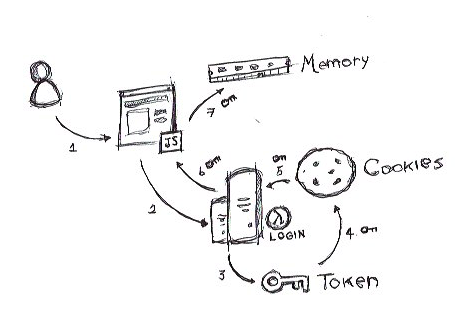
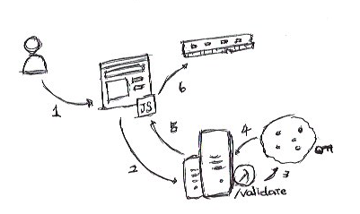

How should tokens be stored safely? It's a common question within the frontend community, and there are a few alternatives. In this post, I'll show you how to do this using cookies and lambdas.

Before we get started, know that using local storage is not a good idea. Malicious scripts can iterate over local storage and send the info to an external API. So, if you have any kind of sensitive data there, you're screwed.

The easiest way of storing a token safely is by just keeping it in memory. This option has some pitfalls in UX. So what should we do?

Cookies are a good tool for this scenario. Of course, you should follow some guidelines to make it safe to do so, such as set the cookie as `secure`, `httpOnly`, and `SameSite=strict`. The `secure` flag ensures that the cookie is sent only over `https` connections, the `httpOnly` flag makes the cookie inaccessible on the client, so malicious scripts cannot see your sensitive data in `document.cookies`, and the `SameSite=strict` flag blocks cookies from being sent to an external domain.

Since the cookie is not available on client side, we need to create some backend logic to fetch the token and store in memory. You can create a BFF(backend for frontends) using a web framework like Rails, Django, Phoenix, Laravel, etc. or you can use lambdas which are very easy and fast to move on. I recommend that you use Netlify Functions or Zeit. Let's see how it looks like.

### Login Flow

In this flow what we are doing is creating a token and storing it in a httpOnly cookie to be protected by our server side preventing it to be accessed from malicious front-end/client scripts. After that, the app can stores the token in memory and use it to run your operations. 

*Notice the function is acting as the cookie guardian where is stored the token.*

You can see a more detailed explanation bellow:

1. User access the login page.
2. Send the credentials to login function.
3. The login function validates the credentials and creates a token if the credentials are valid. If it is not, it returns an unauthorized error.
4. If it is valid, the function saves the token in the cookie as httpOnly so, only servers can access it preventing it to be accessed from malicious front-end/client scripts.
5. (6 and 7) The function returns the token and the app saves it in memory.

Ok, so if my user refreshs the page it will loose the token and crash my app so what we should do? We need to validate the user session trough a validate function.

### Validation Flow

In this flow we need to check if the user is already logged in. So the app send a request to the validate function which will check if there is any token stored in the cookie and if it is valid. If it is valid, the validate functions returns it to the app which will store it in the memory. Like we did before, I put it in a more descriptive way right bellow:

1. A user accesses the app.
2. The app validates the user session.
3. (4 and 5) The function checks if an authorization cookie exists, that the cookie contains a token, and whether the token is valid. If none of these things are true, the function returns an "unauthorized" error.
6. If it is valid, the function returns the token and the app saves it in memory. 

Now we know how to improve your security storing token safely we can implement it. In the next article we are going to implement it using JS, React and FaunaDB. I hope this article is helpful to you and I'll let some nice references bellow for further reading.

Thanks for your time, see ya!

## References
- [https://www.rdegges.com/2018/please-stop-using-local-storage/](https://www.rdegges.com/2018/please-stop-using-local-storage/)
- [https://www.owasp.org/index.php/Cross-site_Scripting_(XSS)](https://www.owasp.org/index.php/Cross-site_Scripting_(XSS))
- [https://www.owasp.org/index.php/Cross-Site_Request_Forgery_(CSRF)](https://www.owasp.org/index.php/Cross-Site_Request_Forgery_(CSRF))
- [https://www.owasp.org/index.php/HttpOnly](https://www.owasp.org/index.php/HttpOnly)
- [https://auth0.com/docs/security/store-tokens](https://auth0.com/docs/security/store-tokens)
