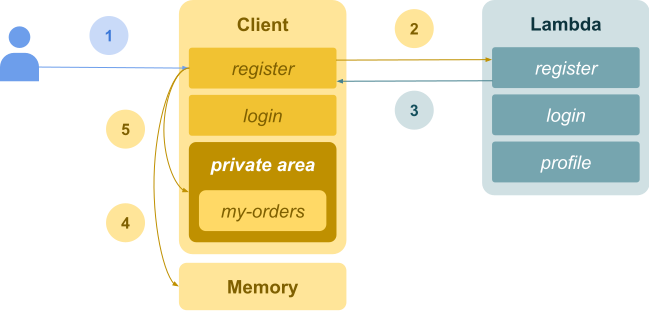
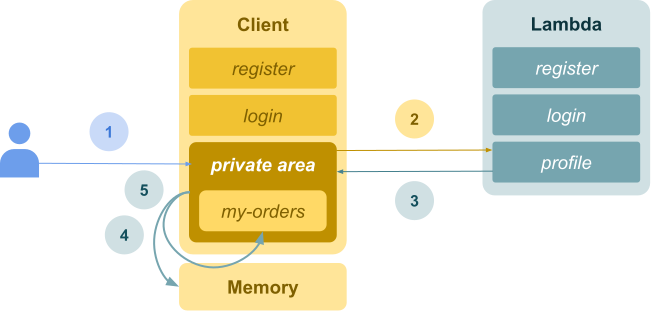

How to store tokens safely? It's a common question on frontend community and there is some alternatives to this. In this post, I'll show you how to do this using cookies and lambdas.

Before we get started, we need to know use local storage is not a good idea, as malicious scripts can iterate over the local storage and send the info to an external API. So if you have any kind of sensitive data there, you're screwed. We also need to know the easiest way of storing a token safely is just keeping it in memory, but this option has some pitfalls in UX. So what should we do?

Cookies are a good tool for this scenario, but of course you should follow some guidelines to make it safe such as set the cookie as `secure`, `httpOnly` and `SameSite=strict`. The `secure` flag ensures that the cookie is sent only over `https` connections, the `httpOnly` makes the cookie inaccessible on client side so malicious scripts cannot see your sensitive data in `document.cookies` and `SameSite=strict` blocks cookies from being sent to an external domain.

Since the cookie is not available on client side, we need to create some backend logic to fetch the token and store in memory. You can create a BFF(backend for frontends) using a web framework like Rails, Django, Phoenix, Laravel, etc. or you can use lambdas which are very easy and fast to move on. I recommend that you use Netlify Functions or Zeit. Let's see how it looks like.

### User login/register flow



The flow for login and register are similar so I put both in the same explanation.

1. **User** access the register/login page.
2. **Client** sends the form data to the endpoint.
3. **Lambda** registers or login the user, generates a token, create a `httpOnly` cookie using the token as value and returns the token on payload to the client.
4. **Client** receives the response. Saves user info and token in memory.
5. **Client** redirects to **Private Area**.

### User access private area directly



1. **User** access **Private Area**.
2. **Private Area** requests user data on `/profile`(you can call "verify", "check" or something that makes sense to you) if there is no user in memory.
3. **Lambda** checks if there is a token cookie, check if the token stills valid, if true, returns the user data with the token(here, you maybe want to refresh the token as well).
4. **Private Area** receives the response. Saves user info and token in memory.
5. **Private Area** render *my-orders* route.

To make it easier to understand here is some code samples using React and Netlify Functions.

**ProtectedArea.jsx**
```jsx
const ProtectedArea = ({ history }) => {
  const { user, fetchUser, isLoading, error } = useUser()

  useEffect(() => {
    if (!user) fetchUser()
  }, [user, fetchUser])

  useEffect(() => {
    if(error && error.code === 401) {
      history.push('/login')
    }
    // ...
  }, [error, history])

  if (isLoading) return <FullPageLoader></FullPageLoader>

  return (
    <Switch>
      <Route exact path="/my-orders" component={MyOrdersPage} />
    </Switch>
  )
}

export default ProtectedArea
```

**lambda_login.js**
```jsx
const cookie = require('cookie')
const hour = 3600000
const oneWeek = 1 * 24 * hour

exports.handler = async event => {
  try {
    const user = login()
    const token = createToken(user)

    return {
      statusCode: 200,
      body: JSON.stringify({ user, token }),
      headers: {
        'Set-Cookie': cookie.serialize(name, val, {
          secure: process.env.NODE_ENV === 'production',
          httpOnly: true,
          path: '/',
          maxAge
        })
      }
    }
  } catch {
    // ...
  }
}
```

**lambda_register.js**
```jsx
const cookie = require('cookie')
const hour = 3600000
const oneWeek = 1 * 24 * hour

exports.handler = async event => {
  try {
    const user = register(event.body)
    const token = createToken(user)

    return {
      statusCode: 201,
      body: JSON.stringify({ user, token }),
      headers: {
        'Set-Cookie': cookie.serialize(name, val, {
          secure: process.env.NODE_ENV === 'production',
          httpOnly: true,
          path: '/',
          maxAge
        })
      }
    }
  } catch {
    // ...
  }
}
```

**lambda_profile.js**
```jsx
const cookie = require('cookie')
const hour = 3600000
const oneWeek = 1 * 24 * hour

exports.handler = async event => {
  try {
    const { token } = cookie.parse(event.headers.cookie || '')

    if (!token) {
      return {
        statusCode: 401,
        body: 'Unauthorized'
      }
    }

    const user = getUserByToken(token)

    return {
      statusCode: 201,
      body: JSON.stringify({ user, token }),
      headers: {
        'Set-Cookie': cookie.serialize(name, val, {
          secure: process.env.NODE_ENV === 'production',
          httpOnly: true,
          path: '/',
          maxAge
        })
      }
    }
  } catch {
    // ...
  }
}
```

Hope this article is helpful to you. Please let me know if you find something wrong with this article or if there is a better way to safely store tokens. Thanks!

## References
- [https://www.rdegges.com/2018/please-stop-using-local-storage/](https://www.rdegges.com/2018/please-stop-using-local-storage/)
- [https://www.owasp.org/index.php/Cross-site_Scripting_(XSS)](https://www.owasp.org/index.php/Cross-site_Scripting_(XSS))
- [https://www.owasp.org/index.php/Cross-Site_Request_Forgery_(CSRF)](https://www.owasp.org/index.php/Cross-Site_Request_Forgery_(CSRF))
- [https://www.owasp.org/index.php/HttpOnly](https://www.owasp.org/index.php/HttpOnly)
- [https://auth0.com/docs/security/store-tokens](https://auth0.com/docs/security/store-tokens)


