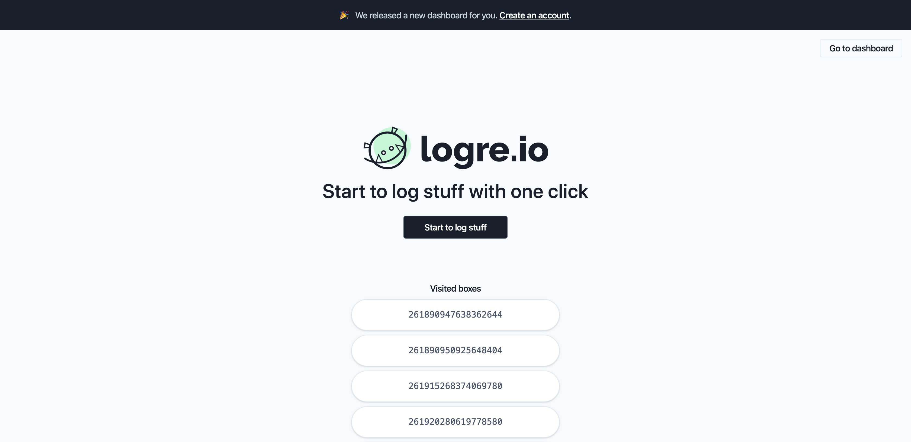

 

Almost two weeks ago I released a side project called [Logre.IO](https://logre.io) and my goal was to create a simplest log tool where people can start to log stuff with only one click without the "burochracy" of create a new account or do some complex setup.

Usually, I do side projects to learn new things and improve my "product" skills. Like most of my previous side projects, I was just expecting a small engagement from close friends but, people started to comment and retweet my initial tweet what mades me really happy and suprised.

<blockquote class="twitter-tweet">
New quarentene/weekend side project. <a href="https://t.co/Qja8LIM1s6">https://t.co/Qja8LIM1s6</a> using <a href="https://twitter.com/hashtag/react?src=hash&amp;ref_src=twsrc%5Etfw">#react</a> <a href="https://twitter.com/hashtag/typescript?src=hash&amp;ref_src=twsrc%5Etfw">#typescript</a> <a href="https://twitter.com/faunadb?ref_src=twsrc%5Etfw">@faunadb</a> and <a href="https://twitter.com/zeithq?ref_src=twsrc%5Etfw">@zeithq</a>
&mdash; Bruno Quaresma (@bruno__quaresma) <a href="https://twitter.com/bruno__quaresma/status/1246543402411479041?ref_src=twsrc%5Etfw">April 4, 2020</a></blockquote> 

 

Here is some statistics from Twitter, Impressions: 19.333, Engagements: 1.487 and some from the app, Boxes: 778, Logs: 189.

After these two weeks we released the "Accounts" feature which basically allow users to create an account and create private boxes.

## How it was build

[Logre.IO](https://logre.io) was literally, a weekend side project and it was only possible because of the amazing available tech and serverless offers. 

We use, [React](https://reactjs.org/) to components and app state management, [Typescript](https://typescriptlang.org/) to make our code more predictable, [TailwindCSS](https://tailwindcss.com/) to style our components, [FaunaDB](https://fauna.com) to stores data safely using the amazing ABAC security layer and [ZEIT](https://zeit.co/) to host our plataform and use serverless functions.

## Next steps

- Add samples on how to use [Logre.IO](https://logre.io) with cloud functions([Zeit](https//zeit.co), [Netlify](https://netlify.com/), etc) and [FaunaDB](https://fauna.com).
- Create a support channel. Probably a Twitter account for now.
- Enable users to create different views to analyze the logs.
- Enable users to extract metrics and valuable info frmo logs.

