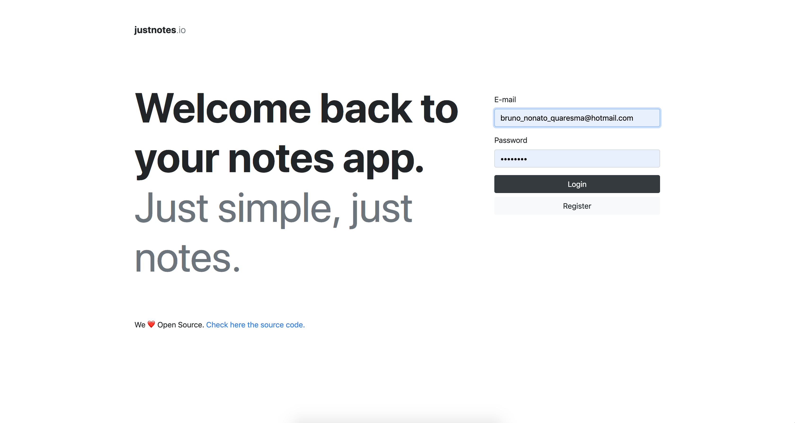

Recentelly I started to develop an app called [justnotes.io](https://justnotes.io) where I'm using to learn new stuff not only in dev field but in design as well. I also want to learn and share knowledge with the community using a real project and eventually, I'll publish some blog posts about those learnings.

The project is using [FaunaDB](https://fauna.com/), React and Typescript. Here is the link to the repo: [https://github.com/BrunoQuaresma/justnotes.io](https://github.com/BrunoQuaresma/justnotes.io).  Take a look and feel free to open issues, pull requests and comment your questions or suggestions like I said, it is a learning project for the community and not only for me.

Thanks for your time. I hope you enjoyed.